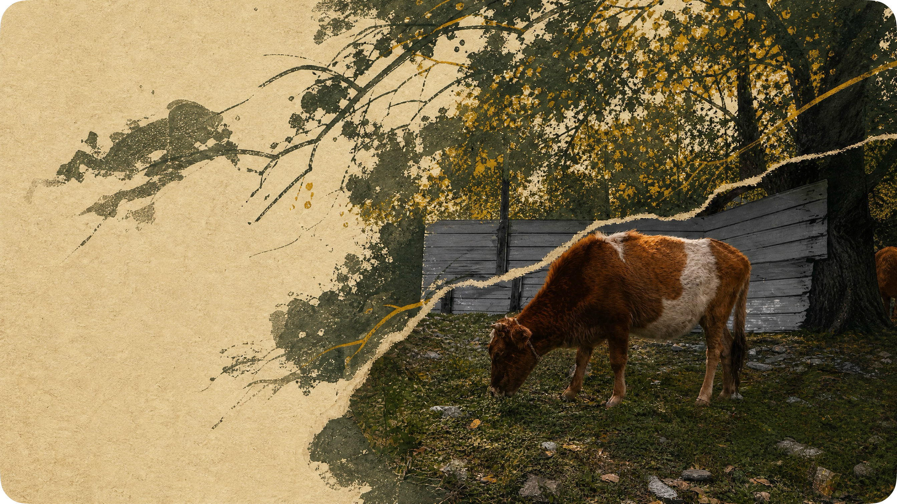

:::note[Information]
**我想把一些走过的路、遇见的人和那些曾在心里停留过很久的念头写下来。时间总会带走很多东西，也会让曾经笃定的答案慢慢变得模糊，而文字或许是与时间相处的一种方式，让此刻的我能够被未来的自己重新看见。记录不是为了证明什么，只是想在不断向前的路上，偶尔回头看看，记得自己曾如何思考、如何爱过、如何迷惘，也如何在岁月里慢慢成为现在的自己。**
:::

 

## 2026-08-18

最近想租房，这件事在心里转了快半个月，却迟迟没有迈出第一步。不是缺钱，也不是没有独自生活的能力，而是心里总有一种说不清的胆怯——搬家怎么搬，房子怎么找，该先到新的城市找好工作，还是先把住处定下来？问题一个叠着一个，还没真正发生，就已经在想象里堆成一座山，压得我迈不开腿。

于是我问自己：我真的是在认真准备，还是在用「想清楚再开始」当借口，逃避那个必须跨过去的门槛？后来才慢慢发现，这之间的界线不在想不想，而在想是否指向行动。准备是为了走，想得太久，准备就悄悄变成了拖延；人最难承认的，往往不是没有能力，而是明明可以开始，却一直站在原地。

《少有人走的路》里说，神经官能症患者总是为自己强加责任。以前我不太明白这句话和自己有什么关系，后来才慢慢明白：想得太多，本身就是一种强加责任。那些还没发生、也未必会降临的问题，我却一件件提前揽到自己肩上，好像今天不把所有可能性想透，就没有资格出发。可责任从来应该发生在问题出现之后，而不是之前。替未来的自己背负今天的全部担忧，看似负责，其实是在给自己套枷锁。

而同一本书的开篇又说：人生苦难重重。这句话起初我只当安慰，后来才读出另一层意思——困难不是要在起点处预先清空的障碍，而是路上必然要经过的东西。站在山脚看，它是挡在面前的阻碍；真的走到山顶回头看，它又成了风景。再详尽的地图，也不能代替脚下的一步；真正的路，只有走起来，才会一段一段地显现。

后来我又想明白一件事：想象和行动，处理问题的方式完全不同。想象是一次性把所有变量都摊在面前，于是十个问题一起压过来，每个都显得不可收拾；行动却每次只处理一个变量，鞋磨脚就换鞋，衣服不吸汗就换衣服，一个问题接着一个问题解决。人之所以被「想太多」困住，很多时候是想用准备换一种控制感——可准备只对已经发生的问题有效，真正的问题，恰恰要靠行动撞上去，才会露出真实的形状。所以「先开始」从来不是鲁莽，而是让问题从想象里的庞然大物，变回现实中一个个可以解决的小事。

就像婴儿学走路，谁也不是一开始就能直立行走，都是先爬，再扶着墙，再摇摇晃晃地站起来。如果一开始就因为「我还不会走」而拒绝尝试，也许一辈子都学不会走路；学自行车也一样，多摔几跤，反而学会了。所谓「最小行动清单」，就是别去想象完整的过程，只找出眼下最小的那一步。一个问题接着一个问题解决，人就不会被还没发生的一大堆问题压垮，还会因为每解决一个小问题，收获一点继续走下去的勇气。

当然，「先开始」也要有一条边界。适合先跑起来的是那些可以回头、可以重来、代价主要由自己承担的事；如果一步落下就难以挽回，或者会牵连到别人，那仍要先停下来想清楚。边界不是用来否定行动的，而是用来提醒自己：先开始，不等于闭着眼睛开始。

想租房和当年写《选择》时想的事，其实是同一件事。不敢开始，和不敢选择，根源都是把后果看得比可能更重，把主动权悄悄让给了恐惧。可无论这一步由谁先迈出，最后承担后果的都只有自己；一个人也只有在真正承担过几次后果之后，才会慢慢相信，自己其实扛得住。既然如此，与其等一个万无一失的「准备好」，不如自己做选择，然后自己迈步。如果总觉得万事俱备才配出发，也许我们永远等不到那一天——人从来不是想清楚了才开始走，而是在走的过程中，才一点一点想清楚；山也不会因为你在山脚多看几眼就变低，但每往前走一步，它都会矮一点。

 

## 2026-08-16

宝宝是笨猪，略略略略！！！！