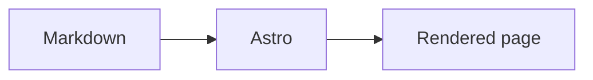

This local-only draft verifies the theme features that are not present in the
published articles. It is available during `pnpm dev` only and is excluded from
production builds.

## Math

Inline math: $E = mc^2$.

$$
\int_0^1 x^2\,dx = \frac{1}{3}
$$

## Code copy

```ts
const message = 'The copy button should copy this line.'
console.log(message)
```

## Mermaid



## Image zoom


## Media embeds

::youtube{id="9pP0pIgP2kE"}

::bilibili{id="BV1sK4y1Z7KG"}

::spotify{url="https://open.spotify.com/track/0HYAsQwJIO6FLqpyTeD3l6"}
